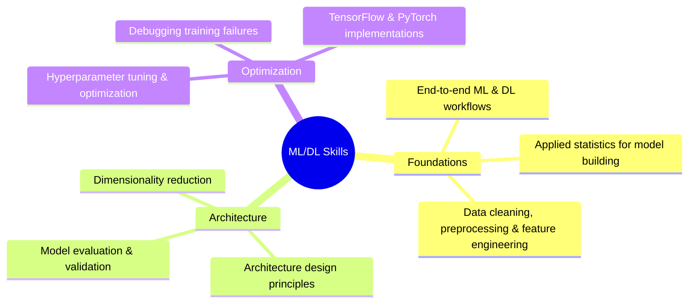

<div align="center">

# 📘 Foundation of Machine Learning & Deep Learning  
## ✨ From Theory to Confident Model Building

<p align="center">
  
  
  
</p>

<p align="center">
  
  
  
  
</p>

<p align="center">
  
</p>


</div>

## 📖 About This Book

<table>
<tr>
<td>

Machine Learning and Deep Learning are now core skills in Computer Science, Data Science, and Artificial Intelligence education. While universities provide strong **theoretical foundations**, many learners face a critical challenge:

> **💡 They understand the theory but struggle to build real, working models.**

This book is written to **bridge that exact gap**.

Rather than focusing only on formulas or ready-made code, this book teaches **how to think**, **how to decide**, and **how to debug** while building Machine Learning and Deep Learning systems.

It transforms learners from **code followers** into **confident model designers**.

</td>
</tr>
</table>


## 🔍 What Makes This Book Different

### 🚀 Beyond Theory, Beyond Copy-Paste Code

```diff
+ Focuses on decision-making, not blind implementation  
+ Explains why each architectural choice is made  
+ Emphasizes real-world workflow over academic abstraction  
```

### 🧠 Learning the Practitioner's Mindset

<details open>
<summary><b>💭 You will clearly understand:</b></summary>

- ✅ Why a CNN is chosen over a Dense network
- ✅ How and where overfitting actually begins
- ✅ How to select activation functions and layers logically
- ✅ How hyperparameters influence performance
- ✅ How to systematically debug failing models

</details>

### 🛠 Learning From Failure

<table>
<tr>
<td width="50%" valign="top">

**🔴 Unlike traditional textbooks, this book:**
- Shows **failed models**
- Explains **training issues**

</td>
<td width="50%" valign="top">

**🟢 Demonstrates:**
- **Systematic debugging**
- Turns mistakes into learning accelerators

</td>
</tr>
</table>


## 🎯 Who This Book Is For

<div align="center">

| 👨‍🎓 Students with ML/DL Theory | 🌱 Complete Beginners | 💼 Aspirants & Researchers |
|:---:|:---:|:---:|
| You know algorithms and math | No prior ML experience required | Internship and project-focused learners |
| You struggle to implement models independently | Starts from libraries, statistics, and preprocessing | Early-stage researchers |
| You want a **clear, repeatable workflow** | Gradually builds toward deep learning systems | Learners preparing for ML/AI roles |

</div>


## 🧩 What You Will Learn

<div align="center">



</div>

<table>
<tr>
<td width="33%" align="center">

</td>
<td width="33%" align="center">

</td>
<td width="33%" align="center">

</td>
</tr>
<tr>
<td width="33%" align="center">

</td>
<td width="33%" align="center">

</td>
<td width="33%" align="center">

</td>
</tr>
<tr>
<td width="33%" align="center">

</td>
<td width="33%" align="center">

</td>
<td width="33%" align="center">

</td>
</tr>
</table>


## 📚 Book Structure

<details>
<summary><b>📌 Chapter 1 – Essential Libraries for Model Building</b></summary>
<br>

- 🔢 NumPy for numerical computation and array-based operations  
- 🐼 Pandas for data manipulation and structured data analysis  
- 📊 Matplotlib and Seaborn for data visualization and exploratory analysis  
- 📈 Practical use-cases of graphs in understanding data and model behavior  
- 🔥 Introduction to PyTorch and TensorFlow as foundational deep learning frameworks  

</details>

<details>
<summary><b>📌 Chapter 2 – Statistics for Deep Learning</b></summary>
<br>

- 📊 Descriptive statistics: central tendency, dispersion, shape, correlation, and covariance  
- 🎲 Inferential statistics: probability theory and probability distributions  
- 🧪 Hypothesis testing and statistical significance in ML experiments  
- 📉 Analysis of variance and confidence intervals for model comparison  
- 🎯 Applying statistical reasoning to understand model behavior and performance  

</details>

<details>
<summary><b>📌 Chapter 3 – Data Cleaning and Preprocessing</b></summary>
<br>

- 📥 Data loading, ingestion pipelines, and data consistency checks  
- 🧹 Handling missing values, inconsistent records, and outliers  
- 🏷️ Encoding categorical variables and numerical transformations  
- ⚖️ Feature scaling, normalization, and transformation techniques  
- 🎯 Feature selection and dimensionality reduction using PCA and autoencoders  
- 📊 Train–validation–test splitting strategies  
- 🖼️ Image data preprocessing for computer vision tasks  

</details>

<details>
<summary><b>📌 Chapter 4 – Architecture & Learning Pipelines</b></summary>
<br>

- 🏗️ Conceptual architecture of computational learning layers  
- 🤔 Architectural considerations for ML vs. DL systems  
- 🔄 End-to-end pipeline design: from problem definition to deployment  
- ⚙️ Data preprocessing, feature engineering, and model training stages  
- 🚀 Evaluation, deployment, monitoring, and lifecycle management  

</details>

<details>
<summary><b>📌 Chapter 5 – Model Evaluation & Validation</b></summary>
<br>

- 🎯 Purpose and importance of model evaluation  
- 📊 Training, validation, and test dataset strategies  
- ⚠️ Overfitting, underfitting, and bias–variance tradeoff  
- 📈 Classification metrics: accuracy, precision, recall, F1-score  
- 🔍 Confusion matrix, ROC curves, and AUC analysis  
- 📉 Regression metrics and cross-validation techniques  

</details>

<details>
<summary><b>📌 Chapter 6 – Machine Learning Workflow</b></summary>
<br>

- 🎓 Supervised, unsupervised, semi-supervised, and reinforcement learning  
- 💡 Problem formulation and data-driven decision-making  
- 🔄 End-to-end machine learning workflow  
- 🏗️ Model building pipelines and iterative experimentation  
- 🎛️ Hyperparameter tuning strategies  

</details>

<details>
<summary><b>📌 Chapter 7 – Practical Machine Learning Implementation</b></summary>
<br>

- 💻 Hands-on implementation of supervised learning models  
- 🔍 Unsupervised and semi-supervised learning implementations  
- 🎚️ Hyperparameter tuning in practical scenarios  
- 📊 Generating predictions and evaluating results  
- 💾 Model persistence: saving, loading, and reuse  

</details>

<details>
<summary><b>📌 Chapter 8 – Deep Learning Fundamentals</b></summary>
<br>

- 🧠 Core deep learning concepts and neural network foundations  
- ⚡ Perceptron, activation functions, and network architectures  
- ➡️ Forward propagation, loss functions, and backpropagation  
- 🎯 Optimization algorithms and learning rate strategies  
- 🛡️ Regularization, weight initialization, and training stability  
- 📉 Vanishing and exploding gradient problems  
- 🔄 Batch training, epochs, early stopping, and workflows  
- ⚠️ Challenges and limitations of deep learning systems  

</details>

<details>
<summary><b>📌 Chapter 9 – Practical Deep Learning Models</b></summary>
<br>

- 🧠 Implementing Artificial Neural Networks (ANNs)  
- 🖼️ Convolutional Neural Networks (CNNs) for image tasks  
- 🔁 Recurrent Neural Networks (RNNs) for sequential data  
- 🔄 Transfer learning for real-world applications  
- 🚀 Model prediction, saving, and deployment readiness  

</details>

<details>
<summary><b>📌 Chapter 10 – Model Selection & Optimization</b></summary>
<br>

- 🎯 Model selection criteria and baseline models  
- ⚖️ Model comparison techniques  
- 🎛️ Hyperparameter optimization methods  
- 🤝 Ensemble learning approaches for performance improvement  

</details>

<details>
<summary><b>📌 Chapter 11 – Fine-Tuning Models</b></summary>
<br>

- 🎨 Concept and importance of fine-tuning  
- 💼 Practical fine-tuning workflows with real examples  

</details>


## 🧪 Frameworks & Tools Used

<div align="center">

| Category | Tools |
|:---:|:---:|
| **💻 Programming Language** |  |
| **🤖 ML/DL Frameworks** |   |
| **📚 Libraries** |      |
| **🛠️ Environment** |   |
| **☁️ Cloud Support** |  |

</div>


## 💻 System Requirements

<table>
<tr>
<td width="50%">

### 🖥️ Recommended Hardware

| Component | Specification |
|-----------|---------------|
| **CPU** | Intel i5 or equivalent |
| **RAM** | 8 GB (minimum) |
| **Storage** | 512 GB SSD |

</td>
<td width="50%" align="center">

<br>

> 🔹 **NVIDIA GPU recommended for deep learning workloads**

<br>

</td>
</tr>
</table>


## 🎯 Learning Outcomes

<div align="center">

### 🌟 After completing this book, readers will:

</div>

<table>
<tr>
<td width="50%" valign="top">

#### 🎨 **Design Skills**
- ✅ Design ML/DL models independently  
- ✅ Make informed architectural decisions  
- ✅ Transition smoothly from theory to practice  

</td>
<td width="50%" valign="top">

#### 🔧 **Practical Skills**
- ✅ Debug and improve underperforming models  
- ✅ Be internship- and project-ready  
- ✅ Build production-ready systems

</td>
</tr>
</table>


## ✍️ Author

<div align="center">

### **Golu Kumar**


<br>

*This book is shaped by real academic struggles, hands-on projects, internships, and repeated encounters with the theory–practice gap faced by students worldwide.*

</div>


## ⭐ Support

<div align="center">

### If you find this work valuable:

<table>
<tr>
<td align="center" width="33%">

</td>
<td align="center" width="33%">

</td>
<td align="center" width="33%">

</td>
</tr>
</table>

</div>


<div align="center">

### 💭 *"From understanding concepts to building real models — this book is your roadmap."*

<br>


</div>
